# ⚡ LLM Acceleration Kernels

**FPGA-accelerated inference primitives for LLMs on PYNQ-Z2 — Vitis HLS, benchmarked against ARM CPU, with an FP16/INT4 quantization study.**

End-of-studies project (WiseCorp internship, ENIT) accelerating the core compute primitives of transformer decoder inference using High-Level Synthesis, dimensioned against real modern LLM parameters (HEAD_DIM=128, rope_theta=1,000,000, MAX_SEQLEN=32768).

---

## 🚀 Kernels

6 HLS kernels covering the decoder pipeline, each validated (NumPy reference), benchmarked (ARM Cortex-A9 baseline), and resource-profiled on the XC7Z020:

| Kernel | Peak Speedup | Bound by |
|---|---|---|
| `rope` | **49.9×** (N=512) | Compute (pipeline, II=1) |
| `silu` | **16.4×** (N=2²⁰) | Compute (LUT sigmoid) |
| `matmul` | **10.1×** (N=1024) | Compute (DSP) |
| `rmsnorm` | **9.9×** (D=2048) | Memory (DDR bandwidth) |
| `softmax` | **7.5×** (R=512) | Compute + control |
| `sample_greedy` | **1.4×** (N=32768) | Memory (DDR, sub-unity at small N) |

## 🎯 Methodology

- Deployed and benchmarked **individually** on **PYNQ-Z2** (Zynq XC7Z020, 220 DSP48E1)
- 4-stage validation: bitstream verification → NumPy correctness check → hardware benchmarking vs. ARM CPU → resource/timing closure
- **Quantization study**: FP32 → **FP16** → **INT4**, comparing hardware resources (BRAM/DSP/FF/LUT) and accuracy trade-offs
  - Matmul: groupwise (per-tile) weight quantization → accuracy holds close to FP16 (99%)
  - RoPE / SiLU: per-tensor activation quantization → larger accuracy loss at INT4 (93.3% / 86.1%)
  - Key finding: **scale granularity, not bit-width, drives the accuracy trade-off**

## 📊 Results

### Hardware Resource Utilization (float32, XC7Z020: 220 DSP48E1, 280 BRAM)

| Kernel | BRAM | DSP | FF | LUT |
|---|---|---|---|---|
| Matmul | 148 (52%) | 160 (72%) | 23430 (22%) | 32488 (61%) |
| RoPE | 64 (22%) | 16 (7%) | 4354 (4%) | 8937 (16%) |
| RMSNorm | 32 (11%) | 62 (28%) | 8766 (8%) | 17619 (33%) |
| Softmax | 9 (3%) | 18 (8%) | 8222 (7%) | 14164 (26%) |
| SiLU | 16 (5%) | 11 (5%) | 5601 (5%) | 9083 (17%) |
| Greedy Sampler | 0 (0%) | 0 (0%) | 9228 (8%) | 13478 (25%) |

### Quantization Techniques

| Technique | Used for | Description |
|---|---|---|
| **Groupwise (per-tile)** | Matmul (weights only) | One scale factor per 32-weight tile (`s = max(\|w\|)/7`); adapts to local dynamic range, mirrors AWQ/GPTQ-style production quantization |
| **Per-tensor (global)** | RoPE, SiLU (activations) | Single scale over the whole tensor; coarser, cannot adapt to local variation |

Both schemes are symmetric, uniform, signed 4-bit (range [-7, 7]). **Key finding**: scale *granularity*, not bit-width, drives the accuracy trade-off — Matmul's groupwise INT4 keeps 92.7% accuracy vs. RoPE/SiLU's per-tensor INT4 dropping to 93.3%/86.1%.

### Resource Utilization: float32 vs. fp16 vs. int4

**Matmul** (groupwise int4)

| Variant | BRAM | DSP | FF | LUT |
|---|---|---|---|---|
| float32 | 148 (52%) | 160 (72%) | 23430 (22%) | 32488 (61%) |
| fp16 | 90 (32%) | 128 (58%) | 14081 (13%) | 15194 (28%) |
| int4 | 90 (32%) | 132 (60%) | 16034 (15%) | 17717 (33%) |

**RoPE** (per-tensor int4)

| Variant | BRAM | DSP | FF | LUT |
|---|---|---|---|---|
| float32 | 64 (22%) | 16 (7%) | 4354 (4%) | 8937 (16%) |
| fp16 | 64 (22%) | 32 (14%) | 4893 (4%) | 9529 (17%) |
| int4 | 64 (22%) | 19 (8%) | 5038 (4%) | 9993 (18%) |

**SiLU** (per-tensor int4)

| Variant | BRAM | DSP | FF | LUT |
|---|---|---|---|---|
| float32 | 16 (5%) | 11 (5%) | 5601 (5%) | 9083 (17%) |
| fp16 | 10 (3%) | 9 (4%) | 5723 (5%) | 8845 (16%) |
| int4 | 7 (2%) | 8 (3%) | 7267 (6%) | 12928 (24%) |

**Note**: int4 always saves BRAM/DSP but *increases* FF/LUT — operands are dequantized to floating point before arithmetic, so the quantize/dequantize wrapper logic adds fabric overhead.

Each kernel includes Python visualization scripts for:
- Latency, throughput & speedup vs. problem size (FPGA vs. CPU)
- Numerical error (MaxErr) & correctness checks
- FP32 vs FP16 vs INT4 resource utilization and accuracy

## 🛠️ Stack

`Vitis HLS 2022.2` · `PYNQ` · `Vivado` · `Python` · `NumPy` · `C++`

## 📁 Structure

```
├── acceleration/                   # baseline float32 kernels + testbenches
│   ├── matmul/                     # matmul.cpp / tb_matmul.cpp
│   ├── rmsnorm/                    # rmsnorm.cpp / rmsnorm_tb.cpp
│   ├── rope/                       # rope.cpp / rope_tables.h / rope_tb.cpp
│   ├── silu/                       # silu.cpp / silu_tb.cpp / sigmoid_lut.h
│   ├── softmax/                    # softmax.cpp / softmax_tb.cpp
│   └── greedy_sampler/             # sg.cpp / sg_tb.cpp
├── quantization/                   # fp16 / int4 kernel variants + testbenches + weights
│   ├── matmul/
│   ├── rope/
│   └── silu/
├── results/                        # benchmark, accuracy & speedup plots
└── README.md
```

> ⚠️ **Note**: for each kernel's bitstream deployment, the `.bit` and `.hwh` files must share the **exact same base filename** (e.g. `rope_kernel.bit` + `rope_kernel.hwh`). The PYNQ driver matches them by name — a mismatched/stale `.hwh` silently produces an incorrect register map without raising an error.

### Decoder Layer Pipeline

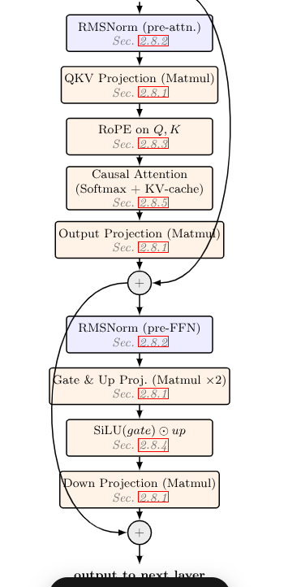

Each block maps to one of the kernels above: RMSNorm → QKV Projection (Matmul) → RoPE → Causal Attention → Output Projection → residual add → RMSNorm → Gate/Up Projection → SiLU → Down Projection → residual add.

## 👤 Author

**Aziz Marnissi** — Electrical Engineering, ENIT · Embedded Systems & On-Device AI
Internship at WiseCorp — Supervisors: Nizar Tlili, Yosri Gafsaoui

---

## 📈 Selected Plots

**Speedup vs. problem size**

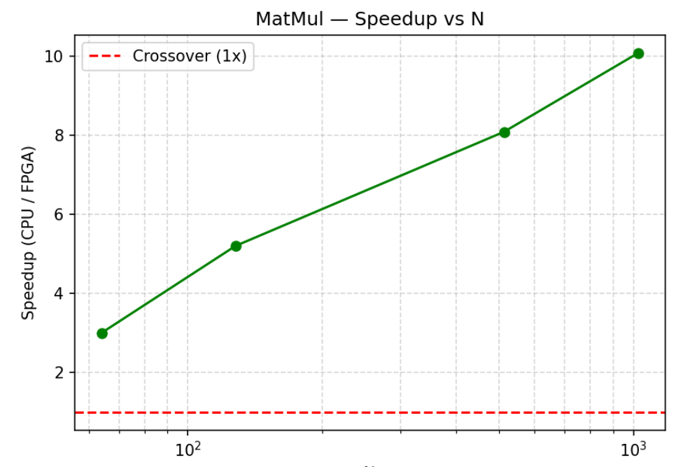
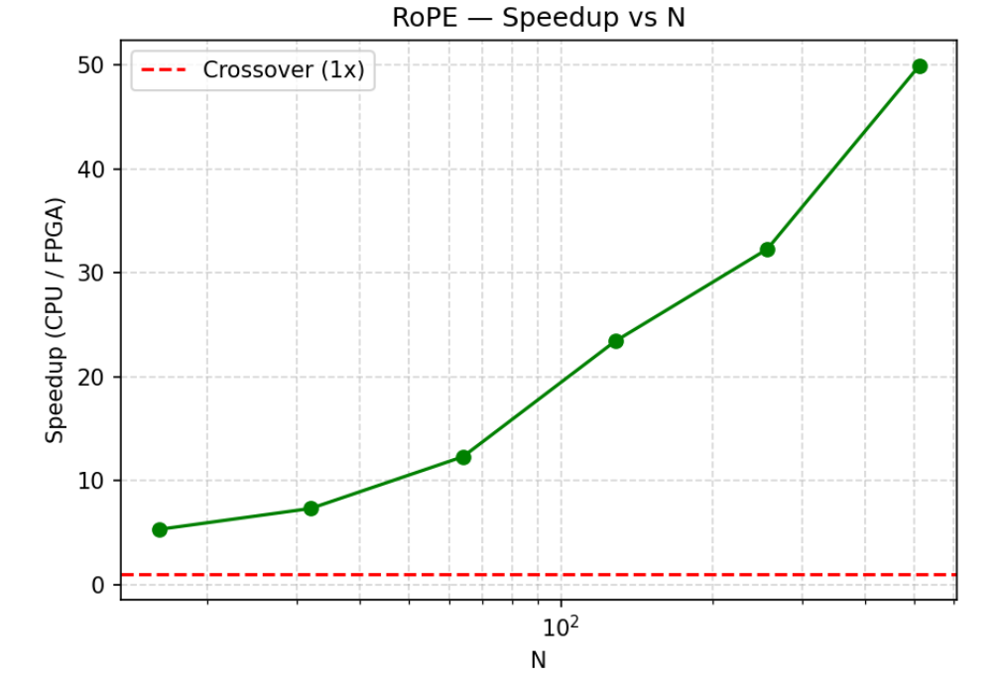
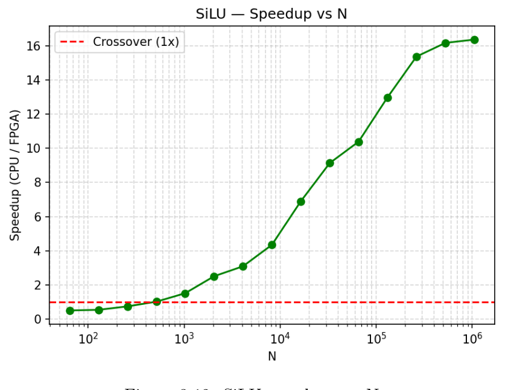
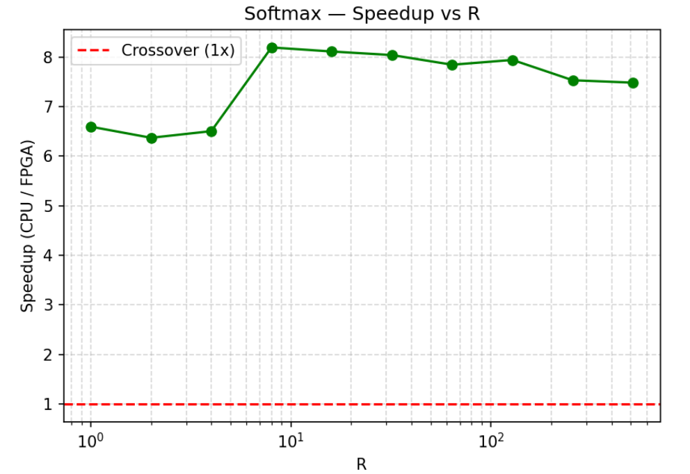
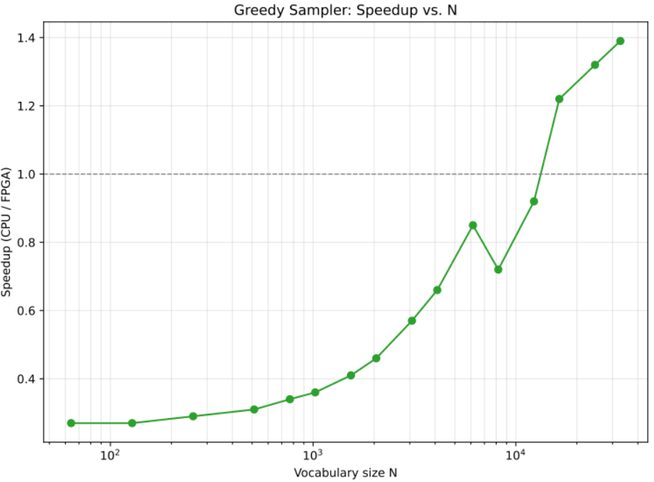

**Quantization: FP32 vs FP16 vs INT4**

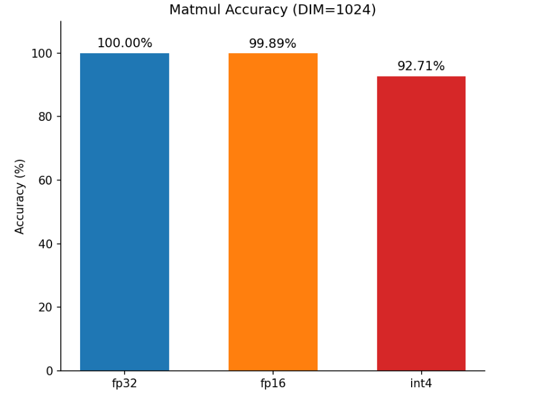
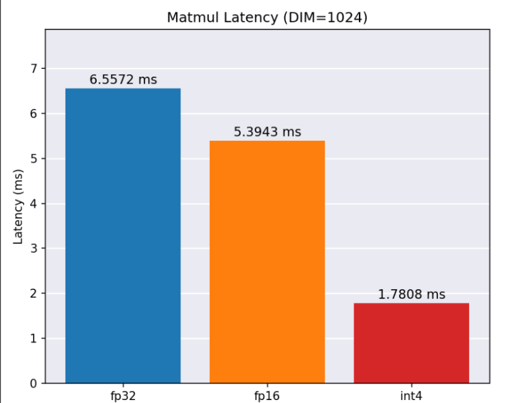
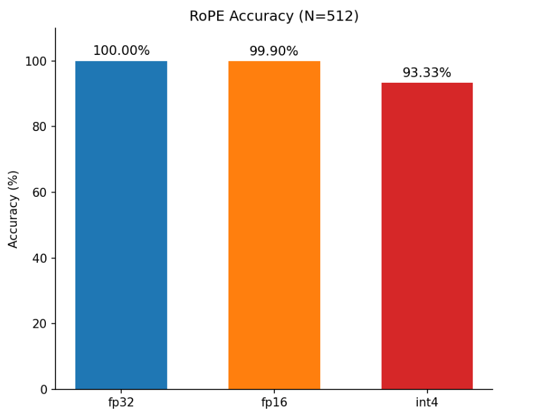
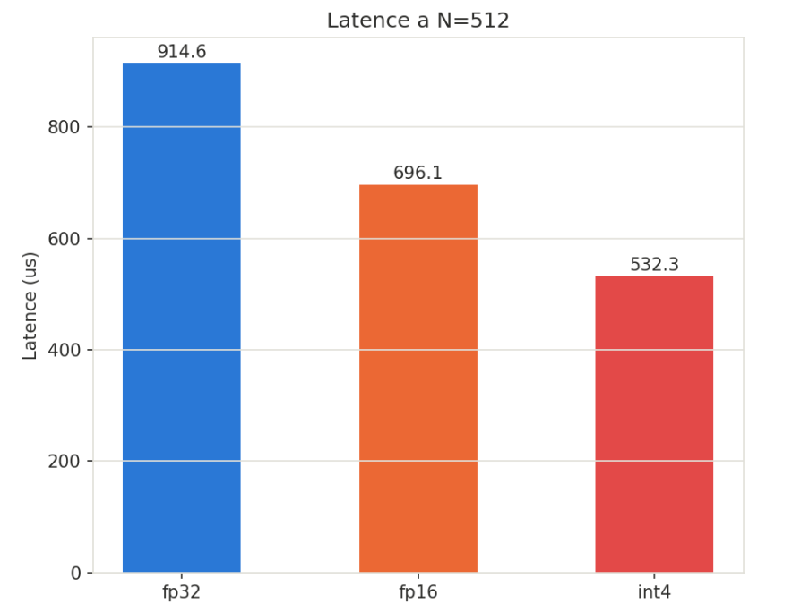
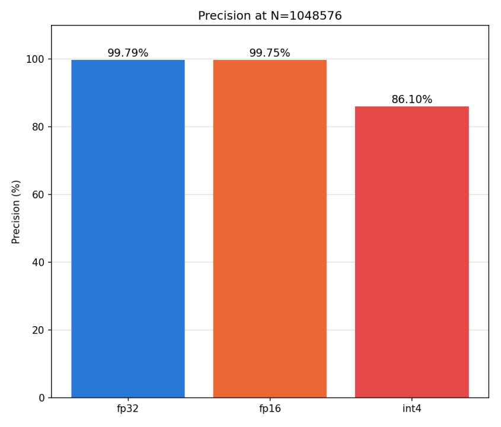
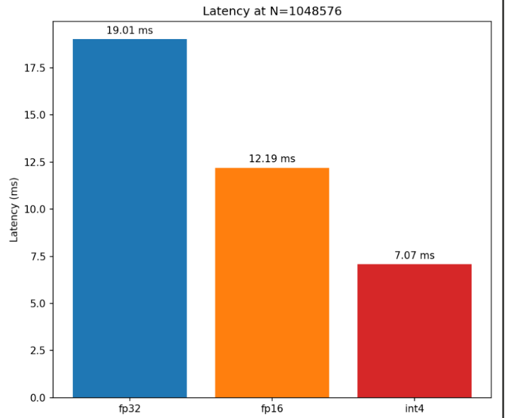
